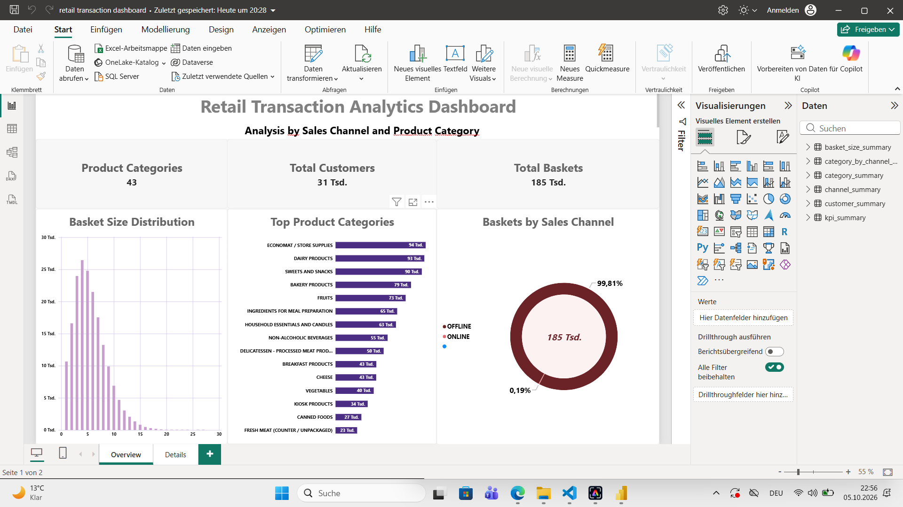
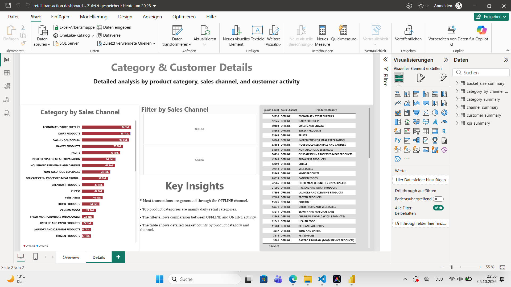

# Retail Transaction Analytics

## Project Overview

Retail Transaction Analytics analyzes anonymized retail transaction data using Python, Pandas, SQL, and Power BI. The project explores basket behavior, product category performance, customer activity, and sales channel distribution through a workflow from data profiling to dashboard reporting.

## Dataset

The source file is `data/Raw/transactions_part_01.csv`. The cleaned data is saved as `data/processed/transactions_part_01_clean.csv`.

| Column | Description |
| --- | --- |
| `PERSON_PUBLIC_KEY` | Anonymized customer identifier |
| `DATE` | Anonymized date identifier |
| `CHANNEL` | Sales channel, such as ONLINE or OFFLINE |
| `PRODUCT_CATEGORY` | Product category associated with a basket |
| `BASKET_ID` | Derived identifier combining customer, date, and channel |

The dataset is anonymized and contains no prices. Analysis focuses on basket counts, distinct categories, customers, and channels.

Exact duplicate rows are removed before analysis. A basket is defined as a unique combination of `PERSON_PUBLIC_KEY`, `DATE`, and `CHANNEL`; separate visits sharing that combination are treated as one basket. Basket size means the number of **distinct product categories** in a basket. Category performance counts each category only once per basket.

## Tools Used

| Tool | Purpose |
| --- | --- |
| Python | Data processing and workflow automation |
| Pandas | Profiling, cleaning, analysis, and CSV exports |
| SQLite | Local database storage |
| SQL | Aggregations and analytical queries |
| Power BI | Dashboard visualization and filtering |
| VS Code | Development environment |

## Workflow

1. Profile the raw data with Python and Pandas: inspect columns, data types, missing values, duplicate rows, and category frequencies.
2. Remove exact duplicate rows.
3. Create `BASKET_ID` from customer, date, and channel.
4. Save the cleaned dataset and explore basket, category, and customer patterns with Pandas.
5. Load the cleaned data into the SQLite `transactions` table.
6. Run SQL queries for KPIs, channels, categories, basket sizes, and customers.
7. Export the SQL results as CSV files.
8. Build a Power BI dashboard to explore the results.

## Dashboard Overview

The Power BI report is stored in `powerbi/retail transaction dashboard.pbix` and is organized into two pages.

### 1. Overview

- KPI cards for the main dataset metrics.
- Basket size distribution by distinct category count.
- Top product categories by unique basket count.
- Baskets by sales channel.

### 2. Details

- Product category performance by sales channel.
- Sales channel filter.
- Category detail table.
- Key insights into basket and category patterns.

## Dashboard Screenshots

### Overview Page



### Details Page



## Key Insights

The current exported SQL results provide the following snapshot:

- **184,648 unique baskets**, **31,122 unique customers**, and **43 product categories** are represented across **1,026,879 rows**.
- **OFFLINE accounts for 99.81% of baskets** (184,299), while ONLINE accounts for 0.19% (349). Channel comparisons should account for this difference in representation.
- **ECONOMAT / STORE SUPPLIES** appears in the most baskets (94,300), followed by **DAIRY PRODUCTS** (92,915) and **SWEETS AND SNACKS** (90,279).

These figures come from `kpi_summary.csv`, `channel_summary.csv`, and `category_summary.csv` in `data/processed/sql_outputs/`. They describe the current dataset and may change when the source data is updated. A basket can contain multiple categories, so category counts should not be added together to calculate total baskets.

## Project Structure

```text
retail-transaction-analytics/
├── data/
│   ├── Raw/
│   │   └── transactions_part_01.csv
│   └── processed/
│       ├── transactions_part_01_clean.csv
│       ├── analysis_outputs/        # Pandas analysis results
│       └── sql_outputs/             # SQL analysis results
├── images/
│   ├── dashboard_overview.png
│   └── dashboard_details.png
├── notebooks/
│   ├── 01_data_profiling.py
│   ├── 02_basic_analysis.py
│   ├── 03_business_analysis.py
│   ├── 04_load_to_sql.py
│   └── 05_sql_analysis.py
├── powerbi/
│   └── retail transaction dashboard.pbix
├── SQL/
│   └── retail_analytics.db
├── .gitignore
└── README.md
```

## How to Run

### 1. Prepare the environment

Install Python 3 and open a terminal in the project root. Install Pandas:

```bash
python -m pip install pandas
```

`sqlite3` and `pathlib` are included with Python. Power BI Desktop is needed to open the dashboard.

### 2. Check the input data

Place the source CSV at `data/Raw/transactions_part_01.csv`. Ensure the `data/processed/` and `SQL/` folders exist. The analysis scripts create their own output subfolders.

### 3. Run the scripts in order

```bash
python notebooks/01_data_profiling.py
python notebooks/02_basic_analysis.py
python notebooks/03_business_analysis.py
python notebooks/04_load_to_sql.py
python notebooks/05_sql_analysis.py
```

The loading script creates `SQL/retail_analytics.db` if needed and replaces the `transactions` table on each run. CSV exports are also overwritten when the analysis scripts run again.

The SQL analysis exports these files to `data/processed/sql_outputs/`:

| File | Contents |
| --- | --- |
| `kpi_summary.csv` | Total rows and unique baskets, customers, and categories |
| `channel_summary.csv` | Unique basket counts and percentage shares by channel |
| `category_summary.csv` | Top 15 categories by unique basket count |
| `basket_size_summary.csv` | Basket counts grouped by number of distinct categories |
| `customer_summary.csv` | Top 10 customers by unique basket count |
| `category_by_channel_summary.csv` | Unique basket counts for each category and channel |

Each SQL export prints its file path and a preview of its first five rows.

### 4. Open the dashboard

Open `powerbi/retail transaction dashboard.pbix` in Power BI Desktop. If prompted, update the data source paths to your local project folder, then refresh the report to load the latest outputs.

## Author 

Houssame
